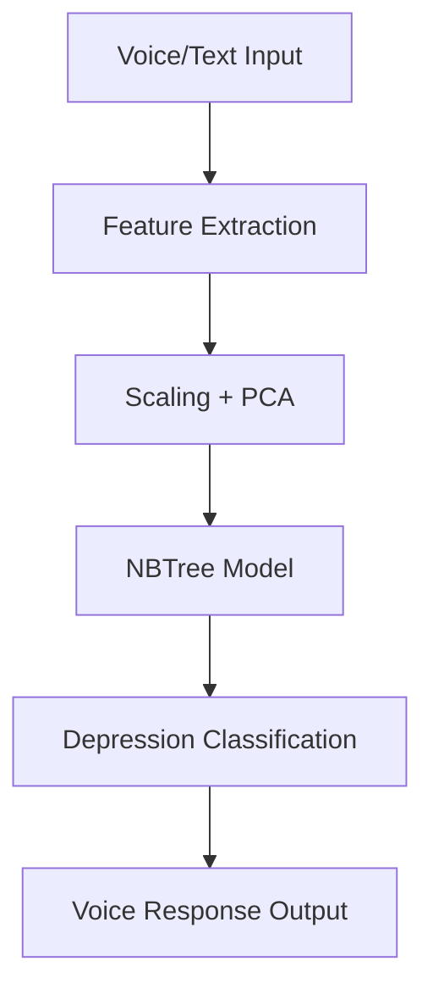

# 🧠 ManoVani – Conversational AI for Depression Detection

**ManoVani** is a voice-enabled AI system that intelligently detects signs of depression by analyzing both speech and text. It simulates an empathetic dialogue with users, offering support while classifying their mental state into:
- 😃 No Depression
- 🙂 Mild / False Depression
- 😔 True Depression

This project aims to assist early mental health diagnosis using machine learning and natural language processing, powered by the DAIC-WOZ dataset.

---

## 🌟 Features

- 🗣️ Voice Assistant (Sakhi)
- 📊 NBTree (Naive Bayes Tree) classifier
- 🎙️ Text + Speech input and output
- 🔐 Local prediction (Privacy-focused)
- 📁 Uses clinical DAIC-WOZ dataset
- 📈 PCA & Standard Scaler-based preprocessing

---

## 🧠 System Flow



📁Project Overview

```graphql
ManoVani/
├── main.py                  # Core execution logic
├── sakhi.py                 # Voice interaction module
├── model.py                 # ML model loading and prediction
├── best_ensemble_model.pkl  # Trained NBTree model
├── scaler.pkl               # StandardScaler for normalization
├── pca.pkl                  # PCA model
├── processed_data.pkl       # Preprocessed features
├── response.mp3             # Final AI-generated response
├── requirements.txt         # Python dependencies
├── README.md                # GitHub project overview
├── index.md                 # GitHub Pages homepage (this file)
├── _config.yml              # GitHub Pages theme config
└── LICENSE                  # MIT License
```

🛠️ Tech Stack
Python 3.11+

scikit-learn, NumPy, pandas

gTTS, SpeechRecognition, PyAudio

PCA, StandardScaler

DAIC-WOZ Dataset

🚀 Run Locally
Clone the repository:

```bash
git clone https://github.com/NandiniJaiswal05/Fake-Depression-Detection-Using-Speech-Analysis.git
cd ManoVani
```
Install dependencies:

```bash
pip install -r requirements.txt
```
Start the application:

```bash
python main.py
```
📦 Dataset
🎯 Name: DAIC-WOZ

🎧 Audio + 📄 Text features

✅ Used: covarep.csv, formant.csv, transcript.csv, audio.wav

📌 Clinical dataset for mental health studies

📄 License
This project is licensed under the MIT License.

⚠️ Disclaimer: ManoVani is a research-based tool and not a substitute for medical advice or treatment.

🙋‍♀️ Author
Nandini Jaiswal
AI/ML Developer | Mental Health Advocate
📍 GHRCE, India
🔗 GitHub

💡 Future Enhancements
Multilingual Voice Support

Doctor/Counselor Integration

Emotional Progress Tracking

Streamlit/Web Frontend

Docker/Android Deployment

🔗 Live GitHub Pages
Once deployed:
📍 https://NandiniJaiswal05.github.io/Fake-Depression-Detection-Using-Speech-Analysis
